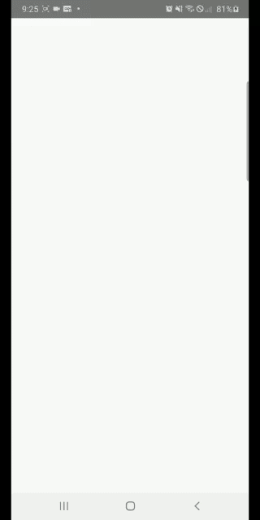

# :palm_tree: :palm_tree:

# <div align="center">Login React Native :octocat:</div>
### <div align="center">Examples of app :fire: !!</div>

<div class="row" align="center">
  
  
</div>

### <div align="center"> Show some ❤️ by starring some of the repositories! </div>

[](https://travis-ci.org/ali-irawan/xtra)
[](https://poser.pugx.org/ali-irawan/xtra/d/total.svg)
[](https://poser.pugx.org/ali-irawan/xtra/v/stable.svg)
[](https://poser.pugx.org/ali-irawan/xtra/v/unstable.svg)
[](https://poser.pugx.org/ali-irawan/xtra/license.svg)

## Dependencies

### Version de React Native

```
npm react-native -v
```

output: **6.14.11**


### Installation of React Navigation

```
npm install @react-navigation/native
```

### Installing dependencies into a bare React Native project

```
npm install react-native-reanimated react-native-gesture-handler react-native-screens react-native-safe-area-context @react-native-community/masked-view
```

**If you're on a Mac and developing for iOS, you need to install the pods**

```
npx pod-install ios
```

### Installing the stack navigator library

```
npm install @react-navigation/stack
```

### Installing the Drawer navigation

```
npm install @react-navigation/drawer
```

### Installing react-native-linear-gradient

```
npm install react-native-linear-gradient --save
```

### Installing Icons

```
npm i --save react-native-vector-icons
```

### Link to React Native

```
npx react-native link react-native-vector-icons
```

### Installing React Native Animatable

```
npm install react-native-animatable --save
```

